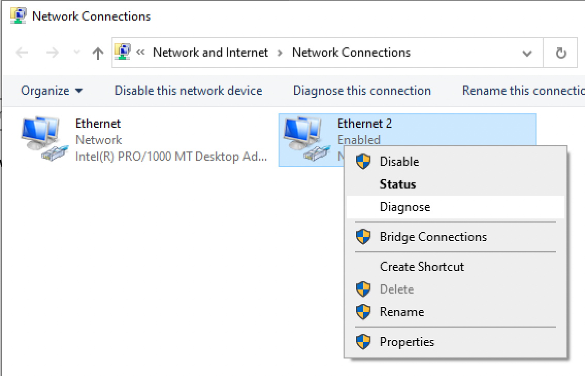

# vm-vagrant

This repository contains all files and instructions necessary to create a self-contained **virtual machine** ([Wikipedia](https://en.wikipedia.org/wiki/Virtual_machine)) on your computer as a software development environment to accompany the book _Real-Time Computing for Mechanical Engineers_. The following setup instructions should work on a "host" (your) machine with Windows, macOS, or Linux.

## Host computer requirements

Your host machine must have Windows, macOS, or Linux and an x86 microprocessor (Apple's M1 processor, which is ARM, is not yet supported).

At least 8 GB of RAM is recommended, but you can get away with 4 GB if you edit the `Vagrantfile` to reduce the default memory and CPU assigned to the virtual machine (see installation video).

## Installation

Since most will be installing on top of a Windows host machine, here's a video walking you through that installation process.

[](https://www.youtube.com/watch?v=b5ZNBc99OnU)

1. Install [Virtualbox](https://www.virtualbox.org/wiki/Downloads), which is a hypervisor that lets you run virtual machines.
2. Install the Extension Pack (same page).
3. Install [Vagrant](https://www.vagrantup.com/downloads), which is a virtual machine builder.
4. Clone, fork, or download this repository. If you do not yet know what `git` is or have it installed on your host computer, simply download this repository by clicking the green **Code** button, then **Download ZIP**, and unzip. We assume you now have this repo in a directory `vm-vagrant` (or `vm-vagrant-main`).
5. There are two ways to generate the virtual machine. 
	1. In a [terminal window](#terminals), `cd` into the directory `vm-vagrant` (or `vm-vagrant-main`) and simply:
	```console
	vagrant up
	```
	2. Use a provided automatic installer for your operating system. 
		1. On macOS, double-click `mac-installer.app`.
		2. On Windows, double-click `win-installer.bat`.

After several minutes (the download is over 10 GB), this will create a new VM called `rtcbook-dist` that should be available in VirtualBox and boot right up. Note that everything should be set up (needs testing) through Part 3 of the CDT for myRIO instructions here:
http://courses.washington.edu/mengr477/resources/CDT_for_myRIO.pdf

After this initial setup, the virtual machine can be accessed directly through Virtual Box.

## Running your virtual machine

The VM you have created is probably already opened in VirtualBox. If not, or later, after you have shut it down, open your VirtualBox app, locate your VM `rtcbook-dist` and double-click (or `Start`).

The **password** is by default `vagrant` for the default user Vagrant. It is recommended you keep the default user profile and password.

You're up and running!

## Configuring your VM (optional)

There are many configuration options for your VM in VirtualBox, accessible in the app through `Settings`, which are [documented here](https://www.virtualbox.org/manual/ch03.html).

Most commonly, you may want to configure your `System` settings to improve performance ([documentation](https://www.virtualbox.org/manual/ch03.html#settings-system)).

You may also want to configure your `Display` settings to improve the scale, video performance, etc. ([documentation](https://www.virtualbox.org/manual/ch03.html#settings-display)).

## Updating

There are two primary components you may want to update.

### Updating your copy of this repo

If there is an update to this repository, you have a few options for updating your local copy.

#### If you forked this repo

In this case, use [GitHub's instructions](https://docs.github.com/en/pull-requests/collaborating-with-pull-requests/working-with-forks/syncing-a-fork).

#### If you cloned this repo

In this case, you can simply `cd` to your local copy and
```console
git pull
```
Note that you cannot push your changes back to the remote (GitHub) because you do not have permissions.

#### If you downloaded the ZIP of this repo

You are pretty much stuck re-downloading or choosing one of the other methods (described in step 4 of [Installation](#installation)) for getting this repo.

**Warning** You should consider saving your old `workspace` directory and potentially bringing in your work to the new copy.

### Updating the Vagrant box

If you would like to update a local Vagrant box built with a previous version of [drrico/rtcbook](https://app.vagrantup.com/drrico/boxes/rtcbook), which is the base of your VM, first delete your old VM in VirtualBox (back up anything you've saved in the machine -- hopefully you've kept all your files in the shared folder, which will not be deleted).

With the associated VM deleted (or shut down), update your local boxes with the following.
```console
vagrant box update
```
You can now re-generate your VM, as before.
```console
vagrant up
```
You may then want to get rid of your local copy of the old box.
```console
vagrant box prune
```

## Support

If you need help, consider opening a new [issue](../../issues).

## Troubleshooting installation

Here are some general considerations, independent of host OS.

1. When generating the virtual machine, `A VirtualBox machine with the name 'rtcbook-dist' already exists`: You have already built the virtual machine. If you are just trying to open the virtual machine, there's no need to rebuild, open VirtualBox and double-click your virtual machine `rtcbook-dist`. If it was unsuccessful and you want to retry, in VirtualBox, right-click the virtual machine `rtcbook-dist`  → `Remove ...`  → `Delete all files`. Now step 5 of [Installation](#installation) should work.

### MacOS host

1. VirtualBox **installation failed**:
	1. Try [this fix](https://mkyong.com/mac/install-virtualbox-on-macos-the-installation-failed/) first.
	2. If that didn't work, explore [these options](https://medium.com/@DMeechan/fixing-the-installation-failed-virtualbox-error-on-mac-high-sierra-7c421362b5b5).
2. Terminal **permission problems**:
	1. Go to  → System Preferences → Security & Privacy → Privacy → Full Disk Access and make sure `Terminal.app` is checked (may need to unlock).
	1. Go to  → System Preferences → Security & Privacy → Privacy → Files and Folders and make sure `Terminal.app` is checked (may need to unlock).

## Troubleshooting the VM

The following issues may occur after installation.

### Can't connect to myRIO target

With the VM running, plugging in the myRIO to one of your computer's USB ports should automatically connect it with your VM. If there are issues, try the following.

1. Make sure the myRIO is connected to your computer via USB.
2. With the VM running, go to the toolbar `Devices` → `USB` and, if it is not checked, click `Linux 3.14.40 ...`. Verify that it is checked and retry.
3. Occasionally, the "ethernet" connection can be corrupted. To ⊞ → `Settings` → `Network & Internet` → `Properties` → `Change Adpater Options`. The `Ethernet 2` connection should appear. Right-click on it and select `Diagnose`, as shown below. Try to automatically repair the connection. It may say the repair was unsuccessful, but it may in fact have worked.


### Missing shared folder/empty workspace

The directory created from this repository, `vm-vagrant` (or `vm-vagrant-main`), should be automatically available on the guest as a shared folder at `C:\vagrant`. Occasionally, something goes wrong and VirtualBox will lose the shared folder. If this happens, it can be re-added in the VirtualBox gui. Alternatively, in a terminal window on the host machine, the following will reconnect the shared folder.
```console
VBoxManage sharedfolder add rtcbook --name vagrant --hostpath "." --automount --auto-mount-point 'C:\vagrant'
```

Alternatively, if you are on a macOS host, the automated app `mac-mount-shared-folder.app` can do this automatically.

## Terminals

A terminal is an interactive command-line program in which a user enters text commands that are interpreted and executed by the operating system.

For a nice tutorial introduction to the terminal on Windows, macOS, and Linux, see [this article](https://tutorial.djangogirls.org/en/intro_to_command_line/). Only the most rudimentary usage is required here.

In Windows, the standard terminal program is `cmd.exe`. 

On macOS, the standard terminal program is `Terminal.app`.

In all major operating systems, the only standard command needed here is `cd`: change directory. You will use this to navigate to the directory `vm-vagrant`.
